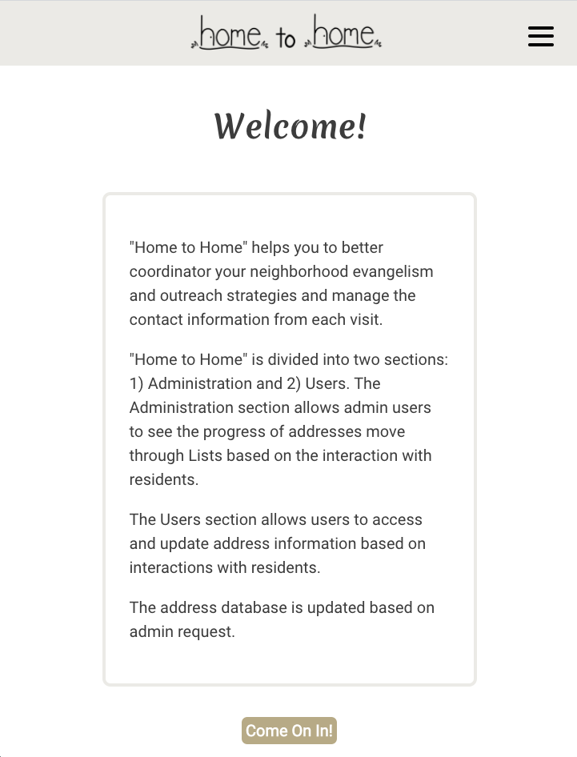
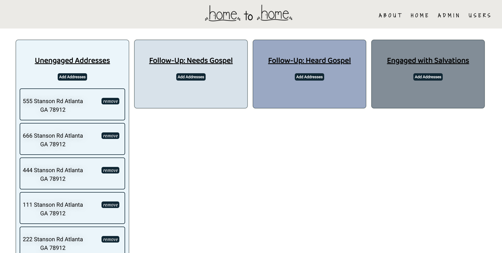
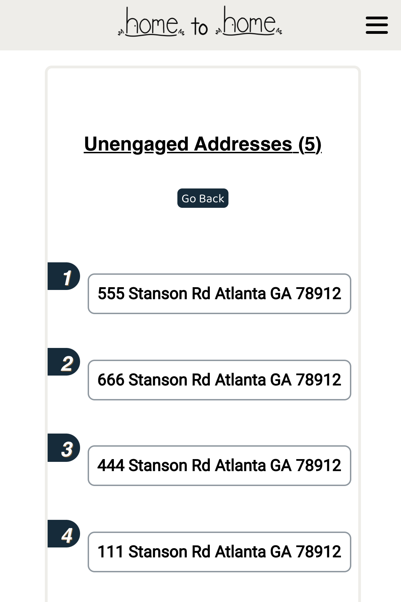
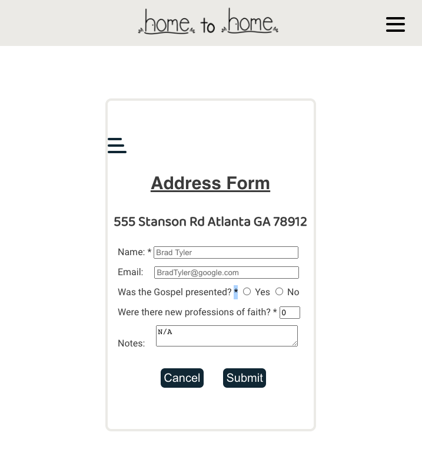
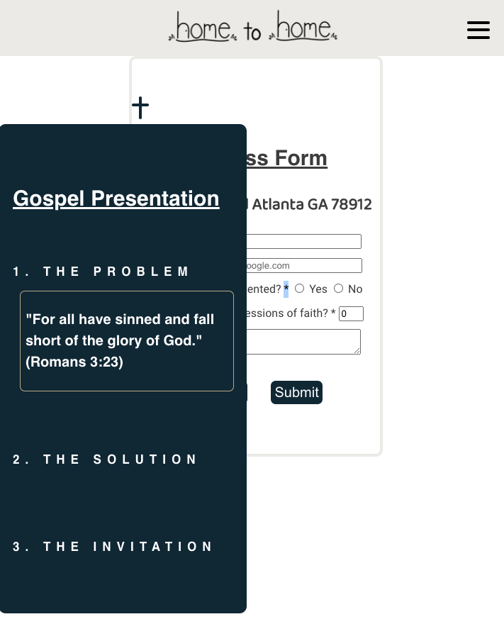

# Home to Home App

Link to live app: https://hometohome-app.now.sh/

## Screen Shots

Landing Page:

This page gives the user information about the app.

Home Page:

This page gives the user options between Admin and User sections.

Admin Page:

This page gives the admin-user the availability to see users address-progression, as well as, edit, remove, and add addresses.

User Page:

This page gives the user access to different teams, which holds addresses, as well as, shows a number to the right of the teams which allows users to see the number of addresses currently in each team.

User's Team Page:

This page gives the user access to addresses within a specific group, as well as, allow them to add addresses.

User Address Submission Page:

This page gives the user the option of updating address information.

Gospel Information Page:

This page gives the user information about the content that should be shared at each address.

## Summary of App
This app allows users to coordinator addresses for neighborhood evangelism and outreach strategies and manage the contact information from each visit.

The app is divided into two sections: 1) Administration and 2) Users.

The Administration section allows admin users to see the progress of addresses as they move through Lists based on the interaction with residents. The Administration section also allows admin users to add, edit, and remove addresses.

The Users section allows users to access and update address information based on interactions with residents. The Users section also allows users to access Gospel information to help them communicate more clearly to each set of residents.

## Technologies Used
React.js/JSX/Enzyme/Jest/HTML/CSS/JSON