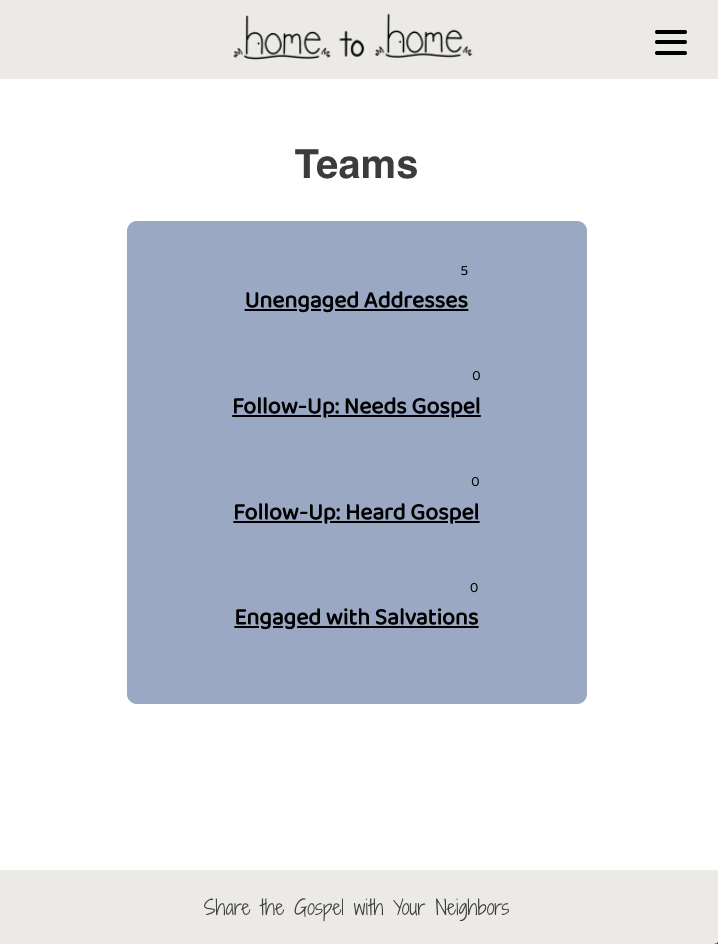

# Home to Home App

Link to live app: https://hometohome-app.now.sh/

## Screen Shots

## Summary of App
This app allows users to coordinator addresses for neighborhood evangelism and outreach strategies and manage the contact information from each visit.
The app is divided into two sections: 1) Administration and 2) Users.
The Administration section allows admin users to see the progress of addresses as they move through Lists based on the interaction with residents. The Administration section also allows admin users to add, edit, and remove addresses.
The Users section allows users to access and update address information based on interactions with residents. The Users section also allows users to access Gospel information to help them communicate more clearly to each set of residents.

## Technologies Used
React.js/JSX/Enzyme/Jest/HTML/CSS/JSON